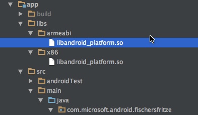

# Fischers Fritze
**a tongue twister game - with a twist**

## Idea

Speech Recognition API claims to understand humans in seven different languages. Time to prove it with tongue twisters! But how could you gamify it and compete with your friends?

By playing it in a language you don't know!

But which language? I'm a German native speaker and my english is okay-ish. 
My second foreign language was BASIC.
Oh wait, it's not being offered by the API. 

**But French is!** (And I'm certified bad at French)


## What's inside

- native Android Project
- Cognitive Services Speech Recognition SDK
- Microphone
- Fragments
- a functional, but ugly UI

## Requirements

- Android Studio / IntelliJ
- Android SDK
- Cognitive Services Speech Recognition API Keys
- Android device with a microphone (because an emulator won't help you here)

## Walkthrough
1. The basics - since we're here on an Android conference, I guess most of you are able to do the basic wireing themselves:
    1. Add an Activity.
    2. A ```ViewPager``` is serving the Fragments, provided from an extended ```FragmentPagerAdapter```
    3. Three Fragments: An OverviewFragment, a GameFragment and a PreferencesFragment
    4. The OverviewFragment is only to explain the game, so add a couple of ```TextView```
    5. Game-Options are set in the PreferencesFragment, which extends ```PreferenceFragment```. We need an ```EditTextPreference``` for the name, one ```ListPreference``` for the recording duration and another ```ListPreference``` for the languages. Hava a look at my keys and values.
    	```xml
        <string name="pref_display_name_key" translatable="false">display_name</string>
        <string name="pref_display_name">Player name</string>
        <string name="pref_display_name_default">John Doe</string>

        <string name="pref_rec_duration_key" translatable="false">rec_duration</string>
        <string name="pref_rec_duration">Recording Duration</string>
        <string name="pref_rec_duration_default" translatable="false">0</string>
        <string-array name="pref_rec_duration_titles">
            <item>@string/rec_duration_short</item>
            <item>@string/rec_duration_long</item>
        </string-array>
        <string-array name="pref_rec_duration_values">
            <item>0</item>
            <item>1</item>
        </string-array>

        <string name="pref_language_key" translatable="false">language</string>
        <string name="pref_language">Language</string>
        <string name="pref_language_default" translatable="false">en-us</string>
        <string-array name="pref_language_titles">
            <item>@string/language_en</item>
            <item>@string/language_fr</item>
            <item>@string/language_de</item>
        </string-array>
        <string-array name="pref_language_values">
            <item>en-us</item>
            <item>fr-fr</item>
            <item>de-de</item>
        </string-array>
        ```
    6. The GameFragment is where the whole logic resides. In order to use ```FloatingActionButtons```, add a ```CoordinatorLayout``` to your fragment XML. Also, add a layout container to anchor the FABs. Add two ```TextView``` and an ```EditText``` to the layout container. Thre resulting layout should look like this.
    	```xml
            <android.support.design.widget.CoordinatorLayout android:id="@+id/main_content"
                                                     android:layout_width="match_parent"
                                                     android:layout_height="match_parent">
            <RelativeLayout
                    android:layout_width="match_parent"
                    android:layout_height="match_parent"
                    android:id="@+id/wrapper">
                <TextView
                        android:layout_width="match_parent"
                        android:layout_height="wrap_content"
                        android:id="@+id/textView_tonguetwister"
                        android:lines="4"
                        android:textColor="@android:color/holo_blue_light"
                        android:textSize="16sp"
                        android:layout_marginBottom="@dimen/activity_vertical_margin"/>
                <TextView
                        android:layout_width="match_parent"
                        android:layout_height="wrap_content"
                        android:lines="1"
                        android:id="@+id/textView_score"
                        android:textColor="@android:color/holo_red_light"
                        android:textSize="16sp"
                        android:layout_marginBottom="@dimen/activity_vertical_margin"
                        android:layout_below="@id/textView_tonguetwister"/>
                <EditText
                        android:layout_width="match_parent"
                        android:layout_height="wrap_content"
                        android:lines="25"
                        android:textSize="12sp"
                        android:id="@+id/editText_result"
                        android:gravity="top|left"
                        android:layout_below="@id/textView_score"
                        android:layout_alignParentBottom="true"
                        android:layout_marginBottom="@dimen/activity_vertical_margin"
                        android:scrollbars="vertical"/>
            </RelativeLayout>
            <android.support.design.widget.FloatingActionButton
                    android:id="@+id/FAB_record"
                    android:layout_width="wrap_content"
                    android:layout_height="wrap_content"
                    app:layout_anchor="@id/wrapper"
                    app:layout_anchorGravity="bottom|right|end"
                    android:layout_margin="@dimen/fab_margin"
                    android:src="@android:drawable/ic_btn_speak_now"/>
            <android.support.design.widget.FloatingActionButton
                    android:id="@+id/FAB_new"
                    android:layout_width="wrap_content"
                    android:layout_height="wrap_content"
                    app:layout_anchor="@id/wrapper"
                    app:layout_anchorGravity="bottom|left|end"
                    android:layout_margin="@dimen/fab_margin"
                    android:src="@android:drawable/ic_menu_revert"/>

        </android.support.design.widget.CoordinatorLayout>
        ```
    7. implement a ```SharedPreferenceChangeListener``` in order to react on changes to the recording duration or language.
    	```java
        private SharedPreferences.OnSharedPreferenceChangeListener sharedPrefslistener =
            new SharedPreferences.OnSharedPreferenceChangeListener() {
                public void onSharedPreferenceChanged(SharedPreferences prefs, String key) {
                    //update your local preferences fields
                }
            };
        ```
    8. Find your widgets in the ```onCreateView()``` method and save them to fields.
    9. Register the ```SharedPreferenceChangeListener``` and get the preferences manually in ```onCreateView()``` to avoid NREs
    	```java
        sharedPreferences = PreferenceManager.getDefaultSharedPreferences(view.getContext());
        sharedPreferences.registerOnSharedPreferenceChangeListener(sharedPrefslistener);
        //set your local preference fields
        ```
	10. Set up ```onclickListener``` for your buttons
	11. Go to [http://www.uebersetzung.at/twister/](http://www.uebersetzung.at/twister/) and choose some languages you don't know. Ok, but choose a least one language you are actually able to speak so you can test-drive your app ;)
	12. Put the tongue twister of your choice in an array and write a static method that returns a random entry.
		```java
        public static String getRandomTongueTwister(String language) {
            Random r = new Random();
            String[] array;

            switch (language) {
                case "de-de":
                    array = german;
                    break;
                case "fr-fr":
                    array = french;
                    break;
                case "en-us":
                default:
                    array = english;
                    break;
            }

            return array[r.nextInt(array.length - 1)];
        }
        ```
    13. Also, add another static method to the helper class. It does the Levenshtein distance calculation, which can be used for our string matching.
    	```java
        public static int levenshteinDistance(CharSequence lhs, CharSequence rhs) {
            if (lhs == null && rhs == null) {
                return 0;
            }
            if (lhs == null) {
                return rhs.length();
            }
            if (rhs == null) {
                return lhs.length();
            }

            int len0 = lhs.length() + 1;
            int len1 = rhs.length() + 1;

            // the array of distances
            int[] cost = new int[len0];
            int[] newcost = new int[len0];

            // initial cost of skipping prefix in String s0
            for (int i = 0; i < len0; i++) cost[i] = i;

            // dynamically computing the array of distances

            // transformation cost for each letter in s1
            for (int j = 1; j < len1; j++) {
                // initial cost of skipping prefix in String s1
                newcost[0] = j;

                // transformation cost for each letter in s0
                for(int i = 1; i < len0; i++) {
                    // matching current letters in both strings
                    int match = (lhs.charAt(i - 1) == rhs.charAt(j - 1)) ? 0 : 1;

                    // computing cost for each transformation
                    int cost_replace = cost[i - 1] + match;
                    int cost_insert  = cost[i] + 1;
                    int cost_delete  = newcost[i - 1] + 1;

                    // keep minimum cost
                    newcost[i] = Math.min(Math.min(cost_insert, cost_delete), cost_replace);
                }

                // swap cost/newcost arrays
                int[] swap = cost; cost = newcost; newcost = swap;
            }

            // the distance is the cost for transforming all letters in both strings
            return cost[len0 - 1];
        }
        ```
    14. Add ```pub.devrel:easypermissions``` or deal with the permissions manually. We need ```android.permission.RECORD_AUDIO``` for our game.
2. Oxford integration
	1. Enough of the tiresome plumbering work! Let's add some more plumbering action :(
	2. To find the latest version of client library, go to [http://search.maven.org](http://search.maven.org), and search for ```g:com.microsoft.projectoxford```. To add the client library dependency from build.gradle file, add the following line in dependencies.
		```gradle
        dependencies {
            //
            // Use the following line to include client library from Maven Central Repository
            // Change the version number from the search.maven.org result
            compile 'com.microsoft.projectoxford:speechrecognition:0.6.0'

            // Your other Dependencies...
        }
        ```
	3. Go to [GitHub](https://github.com/Microsoft/ProjectOxford-ClientSDK/tree/master/Speech/SpeechToText/Android/SpeechSDK/libs) and download the ```libandroid_platform.so``` native files to the lib folder of your project. The size of ```libandroid_platform.so``` file is 22 MB but gets reduced to 4MB at deploy time. You might have to update your build.gradle.
		
        ```gradle
        android {
        	//omitted
            productFlavors {
                x86 {
                    ndk {
                        abiFilter "x86"
                    }
                }
                arm {
                    ndk {
                        abiFilters "armeabi"
                    }
                }
            }

            sourceSets {
                main {
                    jniLibs.srcDir 'libs'
                }
            }
        }
        ```
	4. Add methods to initialize and shutdown the ```MicrophoneRecognitionClient```. these methods will be called ```onResume()``` and ```onPause()```
		```java
        private void initializeMicrophoneClient() {
            try {
                if (this.micClient == null) {
                    this.micClient = SpeechRecognitionServiceFactory.createMicrophoneClient(
                            getActivity(),
                            this.getRecordingDuration(),
                            this.getLanguage(),
                            this,
                            this.getPrimaryKey(),
                            this.getSecondaryKey());
                }
            } catch (Exception e) {
                writeLineToResult("mic initialization exception: " + e.getMessage());
            }
        }
        ````

		```java
        private void shutdownMicrophoneClient() {
            if (this.micClient != null) {
                this.micClient.endMicAndRecognition();
                try {
                    this.micClient.finalize();
                } catch (Throwable throwable) {
                    throwable.printStackTrace();
                }
                this.micClient = null;
            }
        }
        ```
    5. To start and stop the recording, we just call ```startMicAndRecognition``` or ```endMicAndRecognition``` on the ```MicrophoneRecognitionClient```
    	```java
        private void startRecording() {
            if(micClient != null) {
                this.micClient.startMicAndRecognition();
            }

        }

        private void stopRecording() {
            if (this.micClient != null) {
                this.micClient.endMicAndRecognition();
            }
        }
        ```
    6. To receive results from the API we implement the ```ISpeechRecognitionServerEvents``` interface. It requires to add a couple of methods to the fragment.
    7. ```onPartialResponseReceived```is called when we receive a partial result, i.e. recognized tokens. This is helpful with a long recording duration or various other things. We use it for logging or leave it blank.
    8. ```onIntentReceived``` is called when we registered an intent in LUIS and trained it. You can see an intent as a self-defined code word that triggers further actions by the app. This is helpful for bots. We don't need it, so we use it for logging or leave it blank.
    9. ```onError``` is obviously for error events. We use it for logging (and changing the button state).
    10. ```onAudioEvent``` 


## Links

[GitHub](https://github.com/mplogas)
[Xing](https://www.xing.com/profile/Marc_Plogas2)