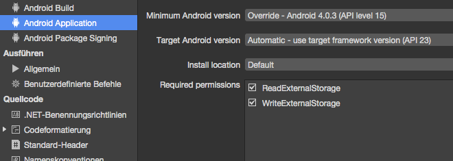

# MimicMe
** a simple Android Game built with Xamarin Forms **

## Idea

So, with the Emotion API as part of the Microsoft Cognitives Services, we have a way of detecting emotions from people. This is nice for tagging photos or helping to read facial expressions. But how could we use it for a fun little game?

At some point, I realized that pulling a face results in different emotions being found by the Emotion API. Different people could create a similar emotion result by mimicing the same face. The idea of MimicMe was born.

The rules are simple: the first player makes a face, the other players mimic the face and try to score a match. The closest match is the winner.

## What's inside?

- Xamarin.Forms Project
- Cognitive Services Emotion SDK
- Camera
- MVVM
- a functional, but ugly UI

## Requirements

- Visual Studio 2015 / Xamarin Studio
- Android SDK
- Cognitive Services Emotion API Key
- Android device with a camera (because an emulator won't help you here)

## Walkthrough

1. Preparing the project
	1. Create a new Xamarin.Forms project
	2. Add the dependency ```Microsoft.ProjectOxford.Emotion``` to the shared code
2. Filesystem access
	1. In order to get access to device-specific functionality, we need a contract in the shared code. Add an interface that provides access to our common tasks.
		```cs
        public interface IFilesystemRepository
        {
            Task<byte []> ReadFileAsync (string filePath);
            Task SaveFileAsync (byte [] buffer, string filePath);
            bool FileExists (string filePath);
        }
        ```
    2. Next, go to the Android project options and add permissions to read and write to the external storage
    	
    3. In the android project, add a new class that implements the interface we just added to the shared code. We can access the filesystem by simple calls to the async methods of ```System.IO.FileStream```
    	```cs
        public class FilesystemRepository : IFilesystemRepository
        {
        	public bool FileExists (string filePath)
            {
                return File.Exists (filePath);
            }

            public async Task<byte []> ReadFileAsync (string filePath)
            {
                if (!FileExists (filePath)) throw new ArgumentException ("file does not exists!");

                byte [] result;

                using (var filestream = File.Open (filePath, FileMode.Open)) {
                    result = new byte [filestream.Length];
                    await filestream.ReadAsync (result, 0, (int)filestream.Length);
                }

                return result;
            }

            public async Task SaveFileAsync (byte [] buffer, string filePath)
            {
                using (var filestream = File.Open (filePath, FileMode.OpenOrCreate, FileAccess.Write)) {
                    await filestream.WriteAsync (buffer, 0, buffer.Length);
                }
            }
        }
        ```
	4. Register the implementation on the built-on DI container of Xamarin.Forms.
		```cs
        [assembly: Dependency (typeof (FilesystemRepository))]
        ```
3. Camera
	1. To get the camera working, we need a platform-specific implementation. Add a result object and an interface to the shared code. The interface will be used later to get the picture from the camera.
		```cs
        public class CameraResult
        {
            public ImageSource Picture { get; set; }

            public string FilePath { get; set; }
        }
        ```

        ```cs
        public interface ICameraProvider
        {
            Task<CameraResult> TakePictureAsync();
        }
        ```
    2. We're going to use the camera app instead of talking directly to the camera. Thus, we don't need any further permissions
    3. Add an implementation of the ```ICameraProvider``` to the platform-specific project. It will start the Camera app through an intent and return a result.
    	```cs
        [assembly: Dependency (typeof (CameraProvider))]
        public class CameraProvider : ICameraProvider
        {
            private static File file;
            private static TaskCompletionSource<CameraResult> tcs;

            public Task<CameraResult> TakePictureAsync ()
            {
                var activity = (Activity)Forms.Context;

                var pictureDirectory = CreateDirectoryForPictures ("MimicMe");
                file = new File (pictureDirectory, String.Format ("photo_{0}.jpg", Guid.NewGuid ()));

                Intent intent = new Intent (MediaStore.ActionImageCapture);
                intent.PutExtra (MediaStore.ExtraOutput, Uri.FromFile (file));
                activity.StartActivityForResult (intent, 0);

                tcs = new TaskCompletionSource<CameraResult> ();
                return tcs.Task;
            }

            private File CreateDirectoryForPictures (string subfolder)
            {
                var directory = new File (Android.OS.Environment.GetExternalStoragePublicDirectory (Android.OS.Environment.DirectoryPictures), subfolder);
                if (!directory.Exists ()) {
                    directory.Mkdirs ();
                }

                return directory;
            }
        }
        ```
    4. To receive the result, override the ```OnActivityResult()``` callback in the MainActivity.cs. Call ``` CameraProvider.OnResult()``` asynchonously and provide the result code.
    	```cs
        protected override void OnActivityResult (int requestCode, Result resultCode, Intent data)
        {
            base.OnActivityResult (requestCode, resultCode, data);
            CameraProvider.OnResult (resultCode);
        }
        ```
    5. We use the ```OnResult()``` method to perform some checks and to wrap our image into our result object.
		```cs
        public static void OnResult (Result resultCode)
        {
            if (resultCode == Result.Canceled) {
                tcs.TrySetResult (null);
                return;
            }

            if (resultCode != Result.Ok) {
                tcs.TrySetException (new Exception ("Unexpected error"));
                return;
            }

            var result = new CameraResult ();
            result.Picture = ImageSource.FromFile (file.Path);
            result.FilePath = file.Path;

            tcs.TrySetResult (result);
        }
        ```

4. Model & Viewmodel
	1. MVVM architecture
		
	2. First, we add a base class that implements ```INotifyPropertyChanged``` to the shared code. Our Model and ViewModel will derive from that class. Our views will be updated when the data changes.
		```cs
        public class BaseNotifyPropertyChanged : INotifyPropertyChanged
        {
            public event PropertyChangedEventHandler PropertyChanged;

            protected virtual void OnPropertyChanged (string propertyName)
            {
                if (PropertyChanged != null) {
                    PropertyChanged (this, new PropertyChangedEventArgs (propertyName));
                }
            }
        }
        ```
	3. Next, we add the model, it will extend ```BaseNotifyPropertyChanged```. Add Getters & Setters for each field and call ```OnPropertyChanged()``` in the Setter.
		```cs
        public class Player : BaseNotifyPropertyChanged
        {
            private string name;
            private CameraResult cameraResult;
            private Emotion emotion;
            private double calculatedScore;
            private bool isGameLeader;

            public string Name {
                get {
                    return this.name;
                }

                set {
                    if (Equals (this.name, value)) return;

                    this.name = value;
                    OnPropertyChanged ("Name");
                }
            }

            //omitted...
        }
        ```
	4. Now, implement the ViewModel. It also extends the ```BaseNotifyPropertyChanged``` class. We provide the camera and filesystem dependency through the constructor. 
		```cs
        public class MainViewModel : BaseNotifyPropertyChanged
    	{
            private ICameraProvider cameraProvider;
            private IFilesystemRepository filesystem;

            public MainViewModel (ICameraProvider cameraProvider, IFilesystemRepository filesystem) {
            	if (cameraProvider == null) {
                	throw new ArgumentNullException ("cameraProvider");
                }
                if (filesystem == null) {
                    throw new ArgumentNullException ("filesystem");
                }

                this.cameraProvider = cameraProvider;
                this.filesystem = filesystem;
            }
        }
        ```
    5. The ViewModel exposes three properties (current player, list of all players, error message) and three commands (take picture, next player, reset the game). Implement them and initialize them in the constructor
    	```cs
        private Player current;
        private string error;
        public ObservableCollection<Player> Game { get; set; }
        public Player Current {
            get {
                return this.current;
            }
            set {
                if (Equals (value, this.current)) {
                    return;
                }
                this.current = value;
                OnPropertyChanged ("Current");
            }
        }

        public string Error {
            get {
                return this.error;
            }
            set {
                if (Equals (value, this.error)) {
                    return;
                }
                this.error = value;
                OnPropertyChanged ("Error");
            }
        }

        public ICommand TakePicture { get; set; }
        public ICommand NextPlayer { get; set; }
        public ICommand ResetGame { get; set; }

        public MainViewModel (ICameraProvider cameraProvider, IFilesystemRepository filesystem)
        {
            //omitted

            this.Current = new Player () { IsGameLeader = true };
            this.Game = new ObservableCollection<Player> ();

            TakePicture = new Command (async () => await TakePictureAsync ());
            NextPlayer = new Command (SaveAndClearPlayer);
            ResetGame = new Command (ClearGame);

            //omitted
        }
        ```
    6. Implement the commands. Before calling the camera, you might want to check permissions. You could use the ```Plugin.Permission``` for that. Keep in mind that you have to update your MainActivity as well.
    	```cs
		void ClearGame ()
        {
            Current = new Player () { IsGameLeader = true };

            Game.Clear ();
            Error = string.Empty;
        }
        ```
        ```cs
		private void SaveAndClearPlayer ()
        {
            Game.Add (Current);
            Current = new Player ();
            Error = String.Empty;
        }
        ```
        ```cs
		private async Task TakePictureAsync ()
        {
            Error = String.Empty;
            Current.CameraResult = await cameraProvider.TakePictureAsync ();
        }
        ```
5. Views
	1. Add a ```CarouselPage``` to the shared code. A class is fine, no need for XAML. We register our ViewModel at the ```BindingContext``` of the ```CarouselPage``` so it will be available to all hosted pages. Resolve the required dependencies through ```DependencyService.Get<T>()```.
		```cs
        public class CarouselView : CarouselPage
        {
            public CarouselView ()
            {
                BindingContext = new MainViewModel (DependencyService.Get<ICameraProvider> (), DependencyService.Get<IFilesystemRepository> ());
                Children.Add (new OverView ());
                Children.Add (new CameraView ());
                Children.Add (new ScoreView ());
            }
        }
        ```
    2. Add new XAML Forms ContentPages to your shared project. They will act as hosted ChildViews within the ```CarouselPage```. We added them to our ```CarouselPage``` already.
    3. Call our newly created ```CarouselPage``` from the ```Application``` object.
		```cs
        public class App : Application
        {
            public App ()
            {
                MainPage = new CarouselView ();
            }
            //omitted
        }
        ```
    3. Add some text and a button to the ```OverView```. The button will reset the game, so it will call on of our commands from the ViewModel
		```xml
        <Button Command="{Binding ResetGame}" Text="Reset the current game" />
        ```
    4. Add a ```ListView``` to our ```ScoreView```. Bind the ```ItemsSource``` to the ```ObservableCollection``` of the ViewModel. Add a ```DataTemplate``` to control the rendering of each item and bind to properties.
    	```xml
        <ListView ItemsSource="{Binding Game}">
			<ListView.ItemTemplate>
				<DataTemplate>
					<ViewCell>
						<StackLayout Orientation="Horizontal">
							<Image Source="{Binding CameraResult.Picture}" WidthRequest="200" HeightRequest="200" HorizontalOptions="Start" />
							<Label Text="{Binding Name}" HorizontalOptions="CenterAndExpand" />
							<Label Text="{Binding CalculatedScore}" HorizontalOptions="EndAndExpand" />
						</StackLayout>
					</ViewCell>
				</DataTemplate>
			</ListView.ItemTemplate>
		</ListView>
        ```
    5. Add an ```Entry``` for the username, a ```Button``` to take a picture, an ```Image``` to display the picture and two ```Label``` for errors and the score to the ```CameraView```. Bind to the corresponding properties and commands of the ViewModel.
    	```xml
        <StackLayout>
			<StackLayout Orientation="Horizontal" Margin="0,40,0,10">
				<Entry Placeholder="Name" Text="{Binding Current.Name, Mode=TwoWay}" Margin="0,0,20,0" HorizontalOptions="FillAndExpand" />
				<Button Text="Take a Picture" Command="{Binding TakePicture}" HorizontalOptions="EndAndExpand" />
			</StackLayout>
			<Label Text="{Binding Error}" TextColor="Red" FontSize="10" />
			<Image Source="{Binding Current.CameraResult.Picture}" HorizontalOptions="CenterAndExpand" />
			<Label Text="{Binding Current.CalculatedScore}" TextColor="Yellow" FontSize="14" />
		</StackLayout>
        ```
    6. Two pages didn't require any implementation in the code-behind file. Our ```CameraView```is a little bit different as the ```Image```control doesn't support command-binding out-of-the-box. The correct approach would be an extended Image control that provides a ```GestureRecognizer``` and bindable ```DependencyProperties```. Give the image a name using ```x:Name``` in XAML and overwrite the ```OnBindingContextChanged``` hook in the code-behind file.
    7. Add a ```TapGestureRecognizer``` to the list of ```GestureRecognizer``` on the image instance. The ```TapGestureRecognizer``` also provides a Command property that can be used to assign a command from our ViewModel. As we need a reference of our ViewModel we can't add the ```GestureRecognizer``` in the constructor. It haven't been bound yet and the call to the ```BindingContext```would yield *NULL*.
    	```cs
        protected override void OnBindingContextChanged ()
        {
            base.OnBindingContextChanged ();

            var viewModel = BindingContext as MainViewModel;

            var tapGestureRecognizer = new TapGestureRecognizer ();
            tapGestureRecognizer.Tapped += async (sender, e) => {
                image.Opacity = .5;
                await Task.Delay (200);
                image.Opacity = 1;
            };
            tapGestureRecognizer.Command = viewModel?.NextPlayer;
            tapGestureRecognizer.CommandParameter = image;

            image.GestureRecognizers.Add (tapGestureRecognizer);
        }
        ```
6. Cognitive Services
	1. Looks good so far. The only thing we don't have is our Emotions API integration. We need to refactor small parts of our application, so it's a good time to commit now ;)
	2. Add an interface for our Emotion API provider
		```cs
        public interface IEmotionProvider
        {
            Task<Emotion []> GetEmotionResultsAsync (Stream stream);
        }
        ```
    3. Create a new class and implement the interface in the shared code.
    	```cs
        public class EmotionProvider : IEmotionProvider
        {
            private readonly EmotionServiceClient client;

            public EmotionProvider (string key)
            {
                client = new EmotionServiceClient (key);
            }

            public async Task<Emotion []> GetEmotionResultsAsync (Stream stream)
            {
                var emotionResults = await client.RecognizeAsync (stream);

                if (emotionResults == null || emotionResults.Length == 0) {
                    throw new Exception ("Can't detect face");
                }

                return emotionResults;
            }
        }
        ```
    4. While we're at it, just create another class that will hold our match calculation logic. I went for the simplest approach, there are probably hundreds of matching algorithms that work better. However, this thing is sufficient for our game.
    	```cs
        public static double CalculateEmotionMatch (Emotion emotion1, Emotion emotion2)
        {
            double difference = 0;

            difference += Math.Abs (emotion1.Scores.Anger - emotion2.Scores.Anger);
            difference += Math.Abs (emotion1.Scores.Contempt - emotion2.Scores.Contempt);
            difference += Math.Abs (emotion1.Scores.Disgust - emotion2.Scores.Disgust);
            difference += Math.Abs (emotion1.Scores.Fear - emotion2.Scores.Fear);
            difference += Math.Abs (emotion1.Scores.Happiness - emotion2.Scores.Happiness);
            difference += Math.Abs (emotion1.Scores.Neutral - emotion2.Scores.Neutral);
            difference += Math.Abs (emotion1.Scores.Sadness - emotion2.Scores.Sadness);
            difference += Math.Abs (emotion1.Scores.Surprise - emotion2.Scores.Surprise);

            return 1.0 - (difference / 8);
        }
        ```
    5. Extend the ViewModel constructor and pass in our ```IEmotionProvider```. Check for *NULL* and save the reference in a field. Pass in a new instance of our ```IEmotionProvider``` from the ```CarouselPage```. Don't forget to provide your API key!
    	```cs
        BindingContext = new MainViewModel (DependencyService.Get<ICameraProvider> (), DependencyService.Get<IFilesystemRepository> (), new EmotionProvider (apiKey));
        ```
    6. Add a small asynchronous helper method to the ViewModel. It should read the picture from the filesystem into a stream and pass it to our ```IEmotionProvider``` instance. The emotion returned should be matched to the emotion result of the game leader. The gameleader doesn't need to have his emotion result matched.
    	```cs
        private async Task GetOxfordScore ()
        {
            if (filesystem.FileExists (Current.CameraResult.FilePath)) {
                var bytes = await filesystem.ReadFileAsync (Current.CameraResult.FilePath);

                try {
                    var result = await emotionProvider.GetEmotionResultsAsync (new MemoryStream (bytes));
                    if (result.Any ()) {
                        Current.Emotion = result.First ();
                        if(!Current.IsGameLeader) {
                            Current.CalculatedScore = Helper.CalculateEmotionMatch (Game.First (p => p.IsGameLeader == true).Emotion, Current.Emotion);
                        } else {
                            Current.CalculatedScore = 1;
                        }
                    }
                } catch (Exception e) {
                    Error = e.Message;
                }
            }
        }
        ```
    7. Call the helper method after taking the picture
    	```cs
        private async Task TakePictureAsync ()
        {
            //omitted
            
            await GetOxfordScore ();
        }
        ```
    8. One last thing. The pictures provided by the smartphone camera are usually too large and rotated. In order to find the face, Emotion API requires the pictures to be not larger than 4MB. We will do the picture postprocessing in the platform-specific code. I've stolen this fancy ```BitmapHelper```from a Xamarin project on GitHub. Unfortunately I don't remember where from. So, if you are developer, drop me a line and I'll add your copyright/credits to it.
    	```cs
        public class BitmapHelper
        {
            public static Bitmap GetAndRotateBitmap (string fileName)
            {
                Bitmap bitmap = BitmapFactory.DecodeFile (fileName);

                // Images are being saved in landscape, so rotate them back to portrait if they were taken in portrait
                // See https://forums.xamarin.com/discussion/5409/photo-being-saved-in-landscape-not-portrait
                // See http://developer.android.com/reference/android/media/ExifInterface.html
                using (Matrix mtx = new Matrix ()) {
                    if (Android.OS.Build.Product.Contains ("Emulator")) {
                        mtx.PreRotate (90);
                    } else {
                        ExifInterface exif = new ExifInterface (fileName);
                        var orientation = (Orientation)exif.GetAttributeInt (ExifInterface.TagOrientation, (int)Orientation.Normal);

                        //TODO : handle FlipHorizontal, FlipVertical, Transpose and Transverse
                        switch (orientation) {
                        case Orientation.Rotate90:
                            mtx.PreRotate (90);
                            break;
                        case Orientation.Rotate180:
                            mtx.PreRotate (180);
                            break;
                        case Orientation.Rotate270:
                            mtx.PreRotate (270);
                            break;
                        case Orientation.Normal:
                            // Normal, do nothing
                            break;
                        default:
                            break;
                        }
                    }

                    if (mtx != null)
                        bitmap = Bitmap.CreateBitmap (bitmap, 0, 0, bitmap.Width, bitmap.Height, mtx, false);
                }

                return bitmap;
            }
        }
        ```
    9. Wrap a call to the helper in a ```Task.Run``` and use the same task to scale the bitmap. Write the processed image back to its original file location.
		```cs
        private static async Task PostProcessPicture (string path)
        {
            Bitmap bitmap = await Task.Run (() => {
                //Get the bitmap with the right rotation
                var tmp = BitmapHelper.GetAndRotateBitmap (path);
                //Resize the picture to be under 4MB (Emotion API limitation and better for Android memory)
                return Bitmap.CreateScaledBitmap (tmp, 2000, (int)(2000 * tmp.Height / tmp.Width), false);
            });

            using (var stream = new System.IO.MemoryStream ()) {
                await bitmap.CompressAsync (Bitmap.CompressFormat.Jpeg, 90, stream);
                stream.Seek (0, System.IO.SeekOrigin.Begin);

                //overwrite the existing image
                using (var writer = System.IO.File.Create (path)) {
                    await writer.WriteAsync (stream.ToArray (), 0, (int)stream.Length);
                }
            }
        }
        ```
    10. Call ```PostProcessPicture()``` from ```OnResult()```. You need to mark ```OnResult``` async and call it using ```Task.Run``` from the MainActivity.
    	```cs
        public static async Task OnResult (Result resultCode)
        {
            //omitted
            await PostProcessPicture (file.Path);

            var result = new CameraResult ();
            result.Picture = ImageSource.FromFile (file.Path);
            result.FilePath = file.Path;

            tcs.TrySetResult (result);
        }
        ```
		```cs
        protected override void OnActivityResult (int requestCode, Result resultCode, Intent data)
        {
            base.OnActivityResult (requestCode, resultCode, data);
            Task.Run (async () => await CameraProvider.OnResult (resultCode));
        }
        ```

## Links

[GitHub](https://github.com/mplogas)
[Xing](https://www.xing.com/profile/Marc_Plogas2)
